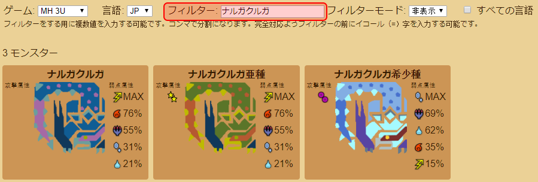
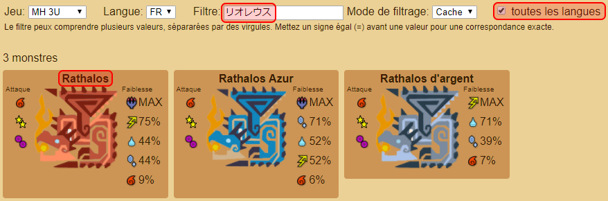

Web application: https://tanukisharp.github.io/mh-monster-info

This project is a rewrite in TypeScript with Angular, of this project https://github.com/TanukiSharp/MHMonstersElements which was written in C# with WPF.

The purpose for this is slightly different, that's why recommended weapon features disappeared, and that attack attribute appeared.

Also, keep in mind that this is more like a self training course than a really useful application.

# Terms of use

*Monster Hunter*™ is a registered trademark or trademark of *Capcom Co., Ltd*.

All data and images are taken from:
- http://monsterhunter.wikia.com/wiki/Monster_Hunter_Wiki
- http://fr.mogapedia.wikia.com/wiki/Wikia_Monster_Hunter
- http://kiranico.com
- TradeSy from discord [Monster Hunter FR](https://discordapp.com/channels/152129764734271488/290080391459766273) for MH3U high quality images
- Hutskuchi from [Mogapedia](http://fr.mogapedia.wikia.com) for some Monster Hunter: World renders

# How to use the application

## Goal

The goal of this application is to help you properly choose your equipment for a given monster to hunt.

## Supported games

Supported games are:
- Monster Hunter 3 Ultimate
- Monster Hunter 4 Ultimate
- Monster Hunter Double Cross
- Monster Hunter: World *(in development)*

It is not planed to add other games for the moment. If you want to add another one, feel free to do so and make a pull request.

## Games

You can select a game using the game selector input:


Switching from a game to another unloads the previous data and loads the new one, in order to avoid consuming too much memory for nothing. *(even if the data is ridiculously small)*

## Language selection

You can select a different language using the language selector input:


This affects the user interface language, and also the name of the monsters.

## Filtering

The goal of this application is to easily find information of one or multiple monsters. To do so, filtering to keep the one(s) you want to see is the best way.

The regular filtering displays monster where their name contains the text you input.


If you are looking for several different monsters at once, you can input multiple filters by separating them with a coma (,) character.

**Note:** the Unicode coma (、 [U+3001](https://unicode-table.com/en/3001)) character is also supported.


Sometimes, you want to find a very specific monster without all its sub species, in this case you can use the equal (=) character for an exact match.

**Note:** the Unicode equal (＝ [U+FF1D](https://unicode-table.com/en/FF1D)) character is also supported.


When you input a filter, it has to correspond with the language you are currently using.



Using a language for filtering that is different than the one displayed results in no match found. *pretty obvious*

However, this is not very useful when you know the name of a monster in a language but want to find it out for another language.


In such a case, you can check the **all languages** (in English) check box beside the **filter mode** dropdown, to allow filtering to match any language.


This is also useful when you want to learn the name of monsters in another language.



The **filter mode** allow you to chose whether filtered out monsters are hidden or grayed. The *hide* filter mode is shown in above screen shots, hereafter is when the *shade* filter mode is used:


In such a case, the monsters do not move on the page whereas filtered and unfiltered. Also, you keep keep track of filtered out monsters if needed.

## Attack values

Attack values are the attributes (element and/or ailment) used by the monster when it attacks you. There is no given specific value, just the type of attribute used, so you know what kind of armor to wear.

Values are usually in order of importance, but this is not necessarily always the case.


## Weakness values

Weakness values are the attributes the monster is the most sensitive to.

There are specific values, but since such values would not make sense, even to the most skilled hunters, the values are given in the form a percentage of the most effective attribute.

For example on the Rathalos, what it dislikes the most is ![Dragon][dragon], so using a ![Dragon][dragon] weapon will potentially make the maximum damage, whereas a ![Thunder][thunder] weapon will apply 75% of elemental damage the ![Dragon][dragon] would have applied. Using a ![Water][water] weapon would apply 44% of what ![Dragon][dragon] would have applied.


**Note:** this does not mean a ![Thunder][thunder] weapon will deal 75% of the total damage a ![Dragon][dragon] weapon would deal. Bear in mind the physical damage, and the base stats of each weapons.

# Hit data gathering tool

I made a tool to help me aggregate monster hit data from various sources faster than computing them myself.

The tool is written in C# (.NET Core) and is located in folder `tools/mh-monster-info-helper`. It parses input data in the form of a table (split by line for rows, and `tab` character for columns), compute the sum of each element, and outputs the result in a ready to copy-paste JSON format.
The tool watches the `input.txt` file and when saved, produces an `output.txt` file.

You can build it by running the command `dotnet build` and run it with `dotnet run`. Note that you must have .NET Core 2.0 or higher installed.

The way to proceed is as follow:

1. Get the source data (here [Kiranico](http://kiranico.com)), select the input data an copy to clipboard


2. Paste data in the `input.txt` file watched by the tool and save the file


3. The tool then generates the output data ready to be copied


4. Paste the JSON data in the monster data file.


**Note:** The tool assumes elements are arranged in ![Fire][fire], ![Water][water], ![Thunder][thunder], ![Ice][ice] and ![Dragon][dragon] order (columns). Most of the time data are arranged this way, but it is not always the case.

In such a case, change the order of the elements in the tool, in file `Program.cs` at line 14:

```
elements = new [] { "fire", "water", "thunder", "ice", "dragon" };
```

# For contributors

## Add a new game

Hereafter is how to add a new game.

Add an entry in the `_availableGames` private field of the `GlobalsService` class found in file `src/app/globals.service.ts`.

```
private _availableGames: IGameInfo[] = [
    { fileNamePart: 'mh3u', title: 'MH 3U' },
    { fileNamePart: 'mh4u', title: 'MH 4U' },
    { fileNamePart: 'mhxx', title: 'MH XX' },
    { fileNamePart: 'mhwi', title: 'MH WI' },
    { fileNamePart: 'my', title: 'MH My' } // <-- add description of new game here
];
```

Then add a JSON file named as the `fileNamePart` in the `src/assets/data/` directory, such as `src/assets/data/my.json`.

Eventually, add a folder named as the `fileNamePart` in the `src/assets/images/monsters/` directory, such as `src/assets/images/monsters/my` and put monster icons in there.

That's it.

About the content of the JSON file, the root object is an array, and the items are as follow:

```
[
    ...
    {
        "icon": 17,
        "names": {
            "EN": "Rathalos",
            "JP": "リオレウス",
            "FR": "Rathalos"
        },
        "attack": {
            "fire": 1,
            "stun": 2,
            "poison": 3
        },
        "weak": {
            "fire": 15,
            "water": 70,
            "thunder": 120,
            "ice": 70,
            "dragon": 160
        }
    },
    ...
]
```

### icon

The `icon` member describes the name of the monster image to display, as `17` implies there must be an image `src/assets/images/monsters/my/17.png`.
Order does not matters.

### names

The `names` member holds the different names of the monster, in different languages.
The English `EN` is mandatory, others are optional and the name of the monster will simply fallback to English for other languages if not provided.

### attack

*See bellow section for details on available attributes and naming.*

The `attack` member contains the types of attribute damage (*element* and/or *ailment*) the monster deals.
In this example, the monster deals ![Fire][fire] (fire), ![Stun][stun] (stun) and ![Poison][poison] (poison) damage.

Some monsters do not deal attributed damage, in this case you can simply remove the whole `attack` member, or keep it empty.

The number beside the attribute is not displayed in the UI, since it's more an indicator of the type of damages dealt than a numeric value.


You are free to set the value you see fit, it will simply be used to sort the icons on the UI, so you can arrange them in order of importance.
Sorting is ascending, so top to bottom are smaller to bigger values.

### weak

*See bellow section for details on available attributes and naming.*

The `weak` member holds numeric values of the monster's weakness per attribute.
The value I've put in available games are sums of all different weaknesses per part of the monster, so it is a mere approximation.
If you are an amateur of extreme accuracy, pass your way.

See `Hit data gathering tool` section above for more details.

Weakness values are displayed in term of percentage of the most sensitive attribute, because I believe displaying the numeric values would not make sense.


Also, for ailments, such as ![Poison][poison] or ![Sleep][sleep], you can input negative value, so they will be arranged at the bottom and the numeric value will not be displayed, it will just become an indicator.

Values are sorted in descending order, so top to bottom are bigger to smaller values.

In case of problem with monster data files, bear in mind you have to respect the JSON format standard: http://json.org/

### Available attributes and naming

For the `attack` and `weak` members of the monster data, hereafter is the list of available attributes and the name you have to respect when listing the attributes.

- ![Fire][fire] "fire"
- ![Water][water] "water"
- ![Thunder][thunder] "thunder"
- ![Ice][ice] "ice"
- ![Dragon][dragon] "dragon"
- ![Poison][poison] "poison"
- ![Noxious Poison][npoison] "npoison"
- ![Deadly Poison][dpoison] "dpoison"
- ![Sleep][sleep] "sleep"
- ![Paralysis][paralysis] "paralysis"
- ![Blast][blast] "blast"
- ![Virus][virus] "virus"
- ![Bleeding][bleeding] "bleeding"
- ![Fatigue][fatigue] "fatigue"
- ![Muddy][muddy] "muddy"
- ![Snowman][snowman] "snowman"
- ![Soiled][soiled] "soiled"
- ![Stun][stun] "stun"
- ![Defense Down][defdown] "defdown"
- ![Confusion][confusion] "confusion"
- ![Effluvial][effluvial] "effluvial"

## Add a new language

In order to add a new language, you fist have to add an entry in the `_availableLanguages` private field of the `GlobalsService` class in the found in the file `src/app/globals.service.ts`.

Then in the `src/assets/localization.json` file, add a new item in the root object, as follow:

```
    ...
    "EN": {
        "GAME": "Game",
        "LANGUAGE": "Language",
        "FILTER": "Filter",
        "FILTER_INFO": "Filter can have several values [...]",
        "ATTACK": "Attack",
        "WEAKNESS": "Weakness",
        "FILTER_ALL_LANGUAGES": "all languages"
    },
    ...
```

The name of the member, here `EN` is displayed on the UI, and is also used to match the name in the monster data file.

Unfortunately, the browser's JSON parser do not allow JSON files to contains comments, so no context can be given in the file. However, all member are pretty obvious I guess.

The last part is the hard one, add monster names to all existing monster data files in `src/assets/data/*.json`.

*See the above section about adding a new game for more details.*

## Hidden feature

### Cookies

The game, language and filter mode you select are persisted to a browser cookie, so when you close your browser and reopen it later on, the page remembers the last game, language and filter mode you used.

### Links

If you want to provide a link to a friend, or bookmark one for yourself, you can add parameters to the link in order to preset the UI input controls.

At the end of the URL, add a `?` symbol, and then the arguments.
It is possible to provide multiple arguments by separating them with a `&` symbol.
Eventually, arguments are made of a key and value, which are separated by an `=` symbol.

Available arguments:

- `lang`: the language to set
- `game`: the game to set

Filer cannot be preset.
Casing of argument name and value do not matter.

Hereafter are examples of links:

- https://tanukisharp.github.io/mh-monster-info?lang=EN&game=mhwi
- https://tanukisharp.github.io/mh-monster-info?lang=JP&game=mhxx
- https://tanukisharp.github.io/mh-monster-info?lang=FR
- https://tanukisharp.github.io/mh-monster-info?game=mh3u

[fire]: doc/images/fire.png "Fire"
[water]: doc/images/water.png "Water"
[thunder]: doc/images/thunder.png "Thunder"
[ice]: doc/images/ice.png "Ice"
[dragon]: doc/images/dragon.png "Dragon"
[poison]: doc/images/poison.png "Poison"
[npoison]: doc/images/npoison.png "Noxious Poison"
[dpoison]: doc/images/dpoison.png "Deadly Poison"
[sleep]: doc/images/sleep.png "Sleep"
[paralysis]: doc/images/paralysis.png "Paralysis"
[blast]: doc/images/blast.png "Blast"
[virus]: doc/images/virus.png "Virus"
[bleeding]: doc/images/bleeding.png "Bleeding"
[fatigue]: doc/images/fatigue.png "Fatigue"
[muddy]: doc/images/muddy.png "Muddy"
[snowman]: doc/images/snowman.png "Snowman"
[soiled]: doc/images/soiled.png "Soiled"
[stun]: doc/images/stun.png "Stun"
[defdown]: doc/images/defdown.png "Defense Down"
[confusion]: doc/images/confusion.png "Confusion"
[effluvial]: doc/images/effluvial.png "Effluvial"
