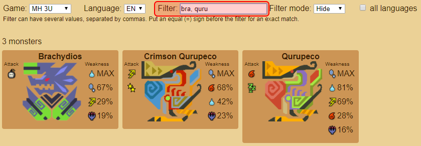

Web application: https://tanukisharp.github.io/mh-monster-info

This project is a rewrite in TypeScript with Angular, of this project https://github.com/TanukiSharp/MHMonstersElements which was written in C# with WPF.

The purpose for this is slightly different, that's why element weakness summary and recommended weapon features disappeared, and that attack attribute appeared.

Also, bear in ming that this is more like a self training course than a really useful application.

# Terms of use

*Monster Hunter*™ is a registered trademark or trademark of *Capcom Co., Ltd*.

All data and images are taken from:
- http://monsterhunter.wikia.com/wiki/Monster_Hunter_Wiki
- http://fr.mogapedia.wikia.com/wiki/Wikia_Monster_Hunter
- http://kiranico.com

# How to use the application

## Goal

The goal of this application is to help you properly choose your equipement for a given monster to hunt.

## Supported games

Supported games are:
- Monster Hunter 3 Ultimate
- Monster Hunter 4 Ultimate
- Monster Huner Double Cross
- Monster Hunter: World *(partially)*

It is not planed to add other games for the moment. If you want to add another one, feel free to do so and make a pull request.

## Games

You can select a game using the game selector input:


Switching from a game to another unloads the previous data and loads the new one, in order to avoid consuming too much memory for nothing. *(even if the data is ridiculously small)*

## Language selection

You can select a different language using the language selector input:


This affects the user interface language, and also the name of the monsters.

## Filtering

The goal of this application is to easily find information of one or multiple monsters. To do so, filtering to keep the one(s) you want to see is the best way.

The regular filtering displays monster where their name contains the text you input.


If you are looking for several different monsters at once, you can input multiple filters by separating them with a coma (,) character.

**Note:** the Unicode coma (、 [U+3001](https://unicode-table.com/en/3001)) character is also supported.



Sometimes, you want to find a very specific monster without all its sub species, in this case you can use the equal (=) character for an exact match.

**Note:** the Unicode equal (＝ [U+FF1D](https://unicode-table.com/en/FF1D)) character is also supported.


When you input a filter, it has to correspond with the language you are currently using.


Using a language for filtering that is different than the one displayed results in no match found. *pretty obvious*

However, this is not very useful when you know the name of a monster in a language but want to find it out for another language.


In such a case, you can check the **all languages** (in English) check box beside the **filter** input box, to allow filtering to match any language.


This is also useful when you want to learn the name of monsters in another language.


## Attack values

Attack values are the attributes (element and/or ailment) used by the monster when it attacks you. There is no given specific value, just the type of attribute used, so you know what kind of armor to wear.

Values are usually in order of importance, but this is not necessarily always the case.


## Weakness values

Weakness values are the attributes the monster is the most sensitive to.

There are specific values, but since such values would not make sense, even to the most skilled hunters, the values are given in the form a percentage of the most effective attribute.

For example on the Rathalos, what it dislikes the most is ![Dragon][dragon], so using a ![Dragon][dragon] weapon will potentially make the maximum damage, whereas a ![Thunder][thunder] weapon will apply 75% of elemental damage the ![Dragon][dragon] would have applied. Using a ![Water][water] weapon would apply 44% of what ![Dragon][dragon] would have applied.


**Note:** this does not mean a ![Thunder][thunder] weapon will deal 75% of the total damage a ![Dragon][dragon] weapon would deal. Bear in mind the physical damage, and the base stats of each weapons.

# Hit data gathering tool

I made a tool to help me aggregate monster hit data from various sources faster than computing them myself.

The tool is written in C# (.NET Core) and is located in folder `tools/mh-monster-info-helper`. It parses input data in the form of a table (split by line for rows, and `tab` character for columns), compute the sum of each element, and outputs the result in a ready to copy-paste JSON format.
The tool watches the `input.txt` file and when saved, produces an `output.txt` file.

You can build it by running the command `dotnet build` and run it with `dotnet run`. Note that you must have .NET Core 2.0 or higher installed.

The way to proceed is as follow:

1. Get the source data (here [Kiranico](http://kiranico.com)), select the input data an copy to clipboard


2. Paste data in the `input.txt` file watched by the tool ans save the file


3. The tool then generates the output data ready to be copied


4. Paste the JSON data in the monster data file.


**Note:** The tool assumes elements are arranged in ![Fire][fire], ![Water][water], ![Thunder][thunder], ![Ice][ice] and ![Dragon][dragon] order (columns). Most of the time data are arranged this way, but it is not always the case.

In such a case, change the order of the elements in the tool, in file `Program.cs` at line 14:

```
elements = new [] { "fire", "water", "thunder", "ice", "dragon" };
```

[fire]: doc/images/fire.png "Fire"
[water]: doc/images/water.png "Water"
[thunder]: doc/images/thunder.png "Thunder"
[ice]: doc/images/ice.png "Ice"
[dragon]: doc/images/dragon.png "Dragon"
